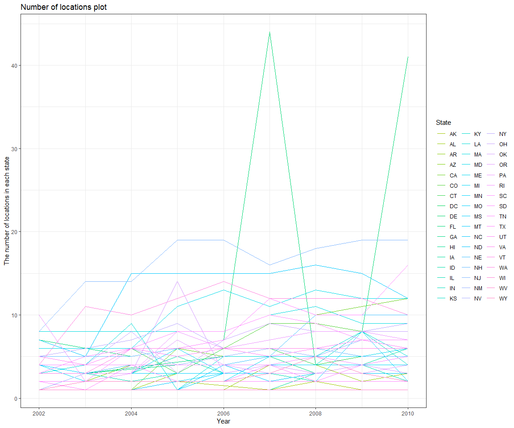
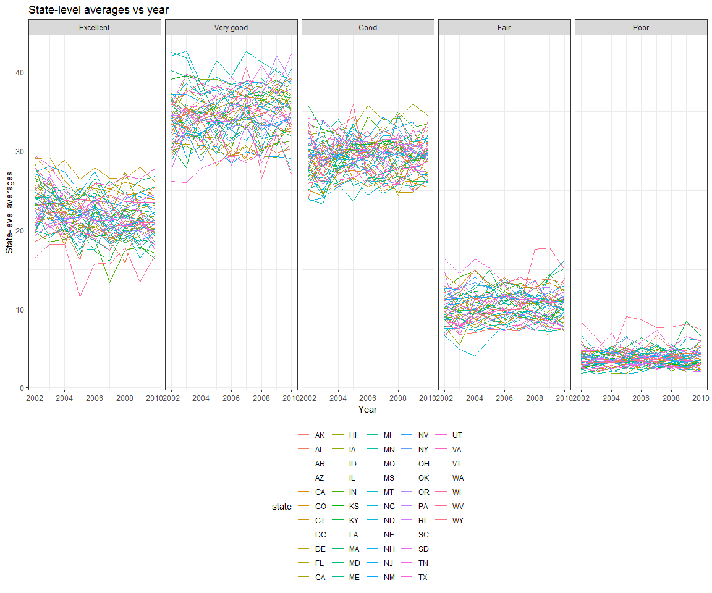
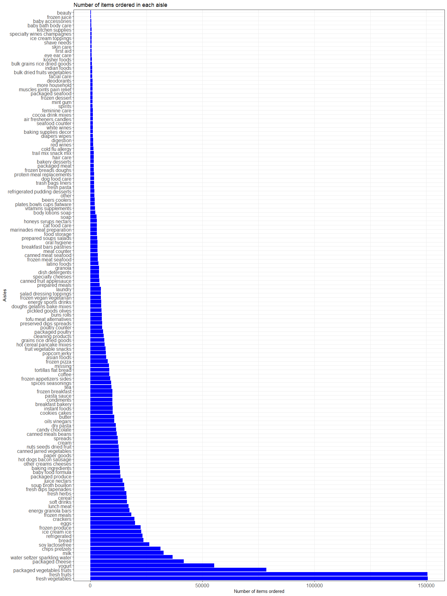

Homework 3
================

Problem 1
---------

load and clean the BRFSS data:

``` r
library(p8105.datasets)
data(brfss_smart2010)

brfss_data = 
  brfss_smart2010 %>% 
  janitor::clean_names() %>% 
  rename(state = locationabbr, location = locationdesc) %>% 
  filter(topic == "Overall Health") %>% 
  mutate(response = factor(response, levels = 
                             c("Excellent", "Very good", "Good", "Fair", "Poor")))
```

Answer the following questions:

a.In 2002, which states were observed at 7 locations?

``` r
brfss_data %>% 
  group_by(year, state) %>%
  summarize(n_location = n_distinct(location)) %>% 
  filter(year == 2002, n_location == 7)
```

    ## # A tibble: 3 x 3
    ## # Groups:   year [1]
    ##    year state n_location
    ##   <int> <chr>      <int>
    ## 1  2002 CT             7
    ## 2  2002 FL             7
    ## 3  2002 NC             7

From the result, we can see in 2002, CT, FL and NC were observed at 7 locations.

b.Make a “spaghetti plot” that shows the number of locations in each state from 2002 to 2010.

``` r
brfss_data %>% 
  group_by(year, state) %>%
  summarize(n_location = n_distinct(location)) %>% 
  ggplot(aes(x = year, y = n_location, color = state)) + 
    geom_line() + 
    labs(
      title = "Number of locations plot",
      x = "Year",
      y = "The number of locations in each state"
    ) +
  scale_color_hue(
    name = "State",
    h = c(100, 350),
    l = 75
  ) +
  theme(legend.position = "right")
```



I used "geom\_line()" to make the "spaghetti plot" to show the trends in the number of locations across 50 states and the District of Columbia over years. The x axis shows the year from 2002 to 2010, and the y axis shows the number of locations in each state in each year. States are differentiated by different colors. The number of locations did not change much over years in most states except Florida. Florida had more than 40 locations in year 2007 and 2010, while the number of locations in all states in other years were less than 20.

c.Make a table showing, for the years 2002, 2006, and 2010, the mean and standard deviation of the proportion of “Excellent” responses across locations in NY State.

``` r
brfss_data %>% 
  group_by(year) %>%
  filter(year %in% c(2002,2006,2010),
         state == "NY", response == "Excellent") %>% 
  summarize(mean_excellent = mean(data_value, na.rm = TRUE),
            sd_excellent = sd(data_value, na.rm = TRUE)) %>% 
  knitr::kable(digits = 1)
```

|  year|  mean\_excellent|  sd\_excellent|
|-----:|----------------:|--------------:|
|  2002|             24.0|            4.5|
|  2006|             22.5|            4.0|
|  2010|             22.7|            3.6|

The table shows the mean and standard deviation of the proportion of “Excellent” responses across locations in NY State for the years 2002, 2006, and 2010. We can see, the proportion of “Excellent” responses was highest in 2002, then slightly declined from 2002 to 2006, and were approximately equal in 2006 and 2010. The standard deviation of the proportion of “Excellent” responses across locations in NY State declined from 2002 to 2010, which means there were less variability with respect to the proportion of “Excellent” responses in years 2006 and 2010 than in year 2002 maybe because the number of observations increased.

d.For each year and state, compute the average proportion in each response category (taking the average across locations in a state). Make a five-panel plot that shows, for each response category separately, the distribution of these state-level averages over time.

``` r
response_average = 
  brfss_data %>% 
  group_by(year, state, response) %>%
  summarize(average = mean(data_value, na.rm = TRUE)) 
response_average
```

    ## # A tibble: 2,215 x 4
    ## # Groups:   year, state [?]
    ##     year state response  average
    ##    <int> <chr> <fct>       <dbl>
    ##  1  2002 AK    Excellent    27.9
    ##  2  2002 AK    Very good    33.7
    ##  3  2002 AK    Good         23.8
    ##  4  2002 AK    Fair          8.6
    ##  5  2002 AK    Poor          5.9
    ##  6  2002 AL    Excellent    18.5
    ##  7  2002 AL    Very good    30.9
    ##  8  2002 AL    Good         32.7
    ##  9  2002 AL    Fair         12.1
    ## 10  2002 AL    Poor          5.9
    ## # ... with 2,205 more rows

``` r
response_average %>% 
  ggplot(aes(x = year, y = average, color = state)) + 
     geom_line() + 
    facet_grid(~response) + 
    labs(
      title = "State-level averages vs year",
      x = "Year",
      y = "State-level averages")
```



I used line plots because they are the most appropriate to show the trends of distribution of the average proportion in each state over time. We can see from the plots that for all states the state-level average proportions in "Very good" were the highest while the state-level average proportions in "Poor" were the lowest from 2002 to 2010. Besides, the distributions of these state-level averages for each category remains relatively constant over years, which implies that responses did not vary apparently over time.

Problem 2
---------

``` r
data(instacart)
head(instacart)
```

    ## # A tibble: 6 x 15
    ##   order_id product_id add_to_cart_ord~ reordered user_id eval_set
    ##      <int>      <int>            <int>     <int>   <int> <chr>   
    ## 1        1      49302                1         1  112108 train   
    ## 2        1      11109                2         1  112108 train   
    ## 3        1      10246                3         0  112108 train   
    ## 4        1      49683                4         0  112108 train   
    ## 5        1      43633                5         1  112108 train   
    ## 6        1      13176                6         0  112108 train   
    ## # ... with 9 more variables: order_number <int>, order_dow <int>,
    ## #   order_hour_of_day <int>, days_since_prior_order <int>,
    ## #   product_name <chr>, aisle_id <int>, department_id <int>, aisle <chr>,
    ## #   department <chr>

The "instacart" dataset gives information about orders from the online company Instacart. The dataset contains 1384617 observations of 131209 unique users, where each row in the dataset is a product from an order. There is a single order per user in this dataset.

There are 15 variables in this dataset:

order\_id: order identifier
product\_id: product identifier
add\_to\_cart\_order: order in which each product was added to cart
reordered: 1 if this prodcut has been ordered by this user in the past, 0 otherwise
user\_id: customer identifier
eval\_set: which evaluation set this order belongs in
order\_number: the order sequence number for this user (1 = first, n = nth)
order\_dow: the day of the week on which the order was placed
order\_hour\_of\_day: the hour of the day on which the order was placed
days\_since\_prior\_order: days since the last order, capped at 30, NA if order\_number = 1
product\_name: name of the product
aisle\_id: aisle identifier
department\_id: department identifier
aisle: the name of the aisle
department: the name of the department

Here's an illstrative example of observations:
The first row means that the user whose ID is 112108 ordered Bulgarian Yogurt on Thursday at 10 am in his/her fourth order and Bulgarian Yogurt was the first item he/she added to cart in this order. This prodcut has been ordered by this user in the past. There were 9 days since his/her last order. The Id of Bulgarian Yogurt is 49302. It was on yogurt aisle and the aisle's id is 120. The Bulgarian Yogurt was from dary eggs department and the Id of this department was 16. This order's Id was 1 and the order belongs in "train" evaluation set.

Answer the following questions:

a.How many aisles are there, and which aisles are the most items ordered from?

``` r
n_item = 
  instacart %>% 
  group_by(aisle) %>% 
  summarise(n_item = n()) %>% 
  arrange(desc(n_item))
head(n_item)
```

    ## # A tibble: 6 x 2
    ##   aisle                         n_item
    ##   <chr>                          <int>
    ## 1 fresh vegetables              150609
    ## 2 fresh fruits                  150473
    ## 3 packaged vegetables fruits     78493
    ## 4 yogurt                         55240
    ## 5 packaged cheese                41699
    ## 6 water seltzer sparkling water  36617

There are 134 aisles. "Fresh vegetables" and "fresh fruits" are ordered most with 150609 and 150473 ordered items respectively.

b.Make a plot that shows the number of items ordered in each aisle. Order aisles sensibly, and organize your plot so others can read it.

``` r
instacart %>% 
  group_by(aisle) %>% 
  summarise(n_item = n()) %>% 
  ggplot(aes(x = reorder(aisle, desc(n_item)), y = n_item)) +
    geom_col(fill = "blue") +
    labs(
      title = "Number of items ordered in each aisle",
      x = "Aisles",
      y = "Number of items ordered") +
  coord_flip() +
  theme(legend.position = "none") +
  theme(axis.text = element_text(size = 12))
```



There are 134 aisles in the dataset. This bar plot shows the number of items ordered across all aisles, ordered from most to least. Fresh vegetables and fresh fruits are most items ordered from while there are least items ordered from the beauty aisle, with only 287 ordered items. Because there are too many aisles, I made a horizontal instead of a vertical bar plot to make the name of the aisles more readilable.

c.Make a table showing the most popular item in each of the aisles “baking ingredients”, “dog food care”, and “packaged vegetables fruits”.

``` r
instacart %>% 
  filter(aisle %in% c("baking ingredients", 
                      "dog food care", "packaged vegetables fruits")) %>% 
  group_by(aisle, product_name) %>% 
  summarise(n = n()) %>% 
  filter(min_rank(desc(n)) == 1) %>% 
  rename(Aisle = aisle, 
         "Product Name" = product_name,
         "Number of orders" = n) %>% 
  knitr::kable(digits = 1)
```

| Aisle                      | Product Name                                  |  Number of orders|
|:---------------------------|:----------------------------------------------|-----------------:|
| baking ingredients         | Light Brown Sugar                             |               499|
| dog food care              | Snack Sticks Chicken & Rice Recipe Dog Treats |                30|
| packaged vegetables fruits | Organic Baby Spinach                          |              9784|

The above table shows the most popular items in the aisles “baking ingredients”, “dog food care”, and “packaged vegetables fruits”. Light Brown Sugar is the most frequently ordered item in the “baking ingredients” aisle with 499 orders. The most popular item is Snack Sticks Chicken & Rice Recipe Dog Treats in the “dog food care” aisle with 30 order and the most popular item in "packaged vegetables fruits" aisle is Organic Baby Spinach with 9784 orders.

d.Make a table showing the mean hour of the day at which Pink Lady Apples and Coffee Ice Cream are ordered on each day of the week.

``` r
instacart %>% 
  filter(product_name %in% c("Pink Lady Apples", "Coffee Ice Cream")) %>% 
  group_by(product_name, order_dow) %>% 
  summarise(mean_order_hour = mean(order_hour_of_day, na.rm = TRUE)) %>% 
  spread(key = order_dow, value = mean_order_hour) %>% 
  rename("Product Name" = product_name, 
         Sunday = "0", Monday = "1", Tuesday = "2",
         Wednesday = "3", Thursday = "4", Friday = "5", 
         Saturday = "6") %>% 
  knitr::kable(digits = 1)
```

| Product Name     |  Sunday|  Monday|  Tuesday|  Wednesday|  Thursday|  Friday|  Saturday|
|:-----------------|-------:|-------:|--------:|----------:|---------:|-------:|---------:|
| Coffee Ice Cream |    13.8|    14.3|     15.4|       15.3|      15.2|    12.3|      13.8|
| Pink Lady Apples |    13.4|    11.4|     11.7|       14.2|      11.6|    12.8|      11.9|

The above table shows that Coffee Ice Cream is usually order in the early afternoon at around 2pm to 3pm for every day of the week except for Friday when the ice cream is ordered earlier. Customers order pink lady apples, on average, ealiear than order Coffee Ice Cream, mostly around noon between 11am to 2pm for every day of the week except Wednesday.

Problem 3
---------

load ny\_noaa data

``` r
data(ny_noaa)
head(ny_noaa)
```

    ## # A tibble: 6 x 7
    ##   id          date        prcp  snow  snwd tmax  tmin 
    ##   <chr>       <date>     <int> <int> <int> <chr> <chr>
    ## 1 US1NYAB0001 2007-11-01    NA    NA    NA <NA>  <NA> 
    ## 2 US1NYAB0001 2007-11-02    NA    NA    NA <NA>  <NA> 
    ## 3 US1NYAB0001 2007-11-03    NA    NA    NA <NA>  <NA> 
    ## 4 US1NYAB0001 2007-11-04    NA    NA    NA <NA>  <NA> 
    ## 5 US1NYAB0001 2007-11-05    NA    NA    NA <NA>  <NA> 
    ## 6 US1NYAB0001 2007-11-06    NA    NA    NA <NA>  <NA>

``` r
ny_noaa %>% 
  filter(is.na(prcp) | is.na(snow) | is.na(snwd) | is.na(tmax) | is.na(tmin)) %>% 
  nrow()
```

    ## [1] 1372743

``` r
ny_noaa %>% 
  filter(is.na(prcp) & is.na(snow) & is.na(snwd) & is.na(tmax) & is.na(tmin)) %>% 
  nrow()
```

    ## [1] 72278

``` r
NA_prcp = 
  ny_noaa %>% filter(is.na(prcp)) %>% nrow()
NA_prcp / nrow(ny_noaa)
```

    ## [1] 0.0561958

``` r
NA_tmax = ny_noaa %>% filter(is.na(tmax)) %>% nrow()
NA_tmax / nrow(ny_noaa)
```

    ## [1] 0.4371025

``` r
NA_tmin = ny_noaa %>% filter(is.na(tmin)) %>% nrow()
NA_tmin / nrow(ny_noaa)
```

    ## [1] 0.4371264

``` r
NA_snow = ny_noaa %>% filter(is.na(snow)) %>% nrow()
NA_snow / nrow(ny_noaa)
```

    ## [1] 0.146896

``` r
NA_snwd = ny_noaa %>% filter(is.na(snwd)) %>% nrow()
NA_snwd / nrow(ny_noaa)
```

    ## [1] 0.2280331

The "NOAA"ny\_noaa" dataset contains weather information of all New York state weather stations from January 1, 1981 through December 31, 2010. The dataset has 2595176 observations and 7 variables. Each observation contains weather data collected from one of the weather stations on one day.
The meaning of the 7 variables are as follow: id: Weather station ID
date: Date of observation
prcp: Precipitation (tenths of mm)
snow: Snowfall (mm)
snwd: Snow depth (mm)
tmax: Maximum temperature (tenths of degrees C)
tmin: Minimum temperature (tenths of degrees C)
Observations for temperature, precipitation and snowfall will be converted to proper units for interpretation.
Each weather station may collect only a subset of these variables, and therefore the resulting dataset contains extensive missing data. Of all observations, 1372743 contain at least one missing value. In addition, 72278 have missing values for all five key variables. There are 145838 (5.62%) missing values for precipitation and 1134358 (43.71%) missing values for tmax and 1134420 (43.71%) missing values for tmin. Also, there are 381221 (14.69%) missing values for snowfall and 591786 (22.80%) missing values for snow depth. A large extent of the data are missing and this might be an issue in the analysis and interpretation of this dataset.
